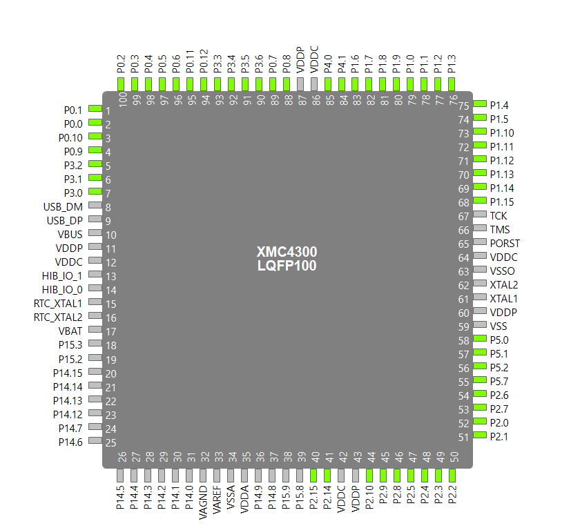

#### imu_to_ethercat

| Function | Pin   |
| -------- | ----- |
| SPI_MOSI | P2.5  |
| SPI_MISO | P2.2  |
| SPI_SCLK | P2.4  |
| IMU_CS_0 | P0.8  |
| IMU_CS_1 | P1.5  |
| IMU_CS_2 | P1.14 |
| IMU_CS_3 | P0.6  |
| IMU_CS_4 | P3.6  |
| IMU_CS_5 | P2.9  |
| IMU_CS_6 | P2.7  |

Pins that can be used for the IMU's CS . Not all of these Pins are broken out in the evaluation board, and note that 3 of them are used for the SPI Bus.  Of the pins that are available on the arduino shield. The following can be used as a GPIO

P1.5, P0.6, P3.6, P1.14, P0.8, P2.8, P2.9, P2.7, P5.0, P0.9, P5.0, P0.9, P0.7, P0.1, P0.0

The rest (P14.0 to 14.4) cannot be used as a chip select.

